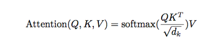

# Attention学习


如图所示，attention发生在decoder的每一步（时间点），主要包括以下3步：

1.当前时间点的decoder隐层状态$h_{t}$,和所有的encoder隐层状态$h_{s}$,计算_attention weights_, 对应公式（1），其中score的计算方式有很多种，公式（4）为两个比较常见的计算方式，其中$h_{s}$对应attention体系中的key和value（key和value一样），$h_{t}$则对应attention体系中的query



2.基于计算好的_attention weights_， 再乘以value本身，得到_context vector_

3.将_context vector_和$h_{t}$拼到一起，然后作为decoder的下一个时间点的输入


## 具体代码实现
```
# attention_states: [batch_size, max_time, num_units]
attention_states = tf.transpose(encoder_outputs, [1, 0, 2])

# Create an attention mechanism
attention_mechanism = tf.contrib.seq2seq.LuongAttention(
    num_units, attention_states,
    memory_sequence_length=source_sequence_length)
```
attention_states即为encoder的最后一个隐层的输出，同时作为decoder的隐层的初始化值。

```
  # Reshape from [batch_size, depth] to [batch_size, 1, depth]
  # for matmul.
  query = array_ops.expand_dims(query, 1)

  # Inner product along the query units dimension.
  # matmul shapes: query is [batch_size, 1, depth] and
  #                keys is [batch_size, max_time, depth].
  # the inner product is asked to **transpose keys' inner shape** to get a
  # batched matmul on:
  #   [batch_size, 1, depth] . [batch_size, depth, max_time]
  # resulting in an output shape of:
  #   [batch_size, 1, max_time].
  # we then squeeze out the center singleton dimension.
  score = math_ops.matmul(query, keys, transpose_b=True)
  score = array_ops.squeeze(score, [1])
```
这段代码是计算点积方式score function的代码，query的输入shape是[batch_size, depth]，先expand到[batch_size, 1, depth]，然后直接和keys做点积操作，得到结果的shape为[batch_size, 1, max_time], 再将中间的维度去掉。

`alignments = self._probability_fn(score, state)`

得到的结果再做softmax，得到_attention weights_
```
alignments, next_attention_state = attention_mechanism(
      cell_output, state=attention_state)
```
这步即对应公式（1）
```
  context = math_ops.matmul(expanded_alignments, attention_mechanism.values)
  context = array_ops.squeeze(context, [1])
```
此步对应公式（2）
```
  if attention_layer is not None:
    attention = attention_layer(array_ops.concat([cell_output, context], 1))
  else:
    attention = context

  return attention, alignments, next_attention_state
```
此处的代码为_context vector_和$h_{t}$拼接, 对应公式（3）
