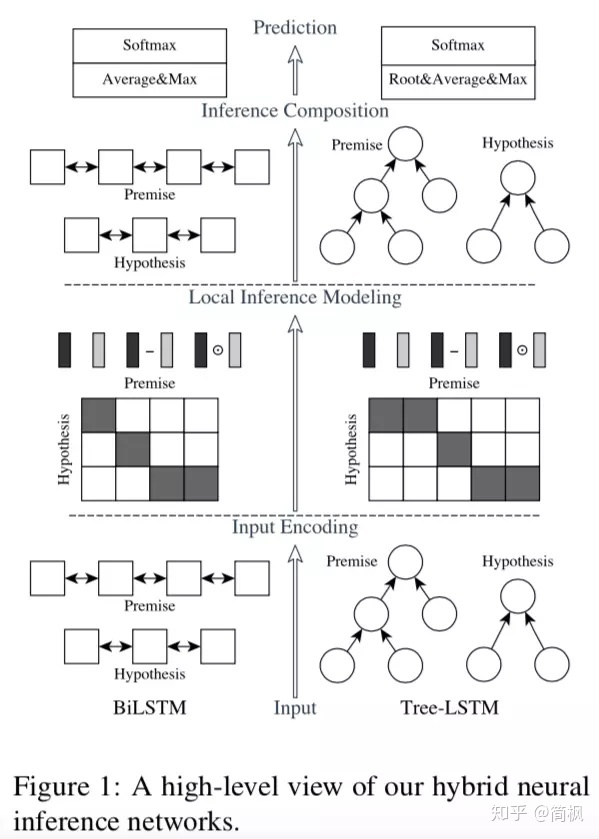

### ESIM

论文地址:
https://arxiv.org/pdf/1609.06038.pdf

ESIM的基本结构就是query和question分别先过lstm，得到的结果互相做attention计算，attention的结果再过lstm，然后将lstm的隐层输出结果分别取max-pooling和avg-pooling，再过mlp+softmax得到结果。

query和question分别通过BiLSTM编码器得到隐层的输出:
$$\overline{a}_i = BiLSTM(a, i)$$
$$\overline{c}_j = BiLSTM(b, j)$$

通过计算两者的交叉注意力值，对两个query之间的局部语义关系进行建模，注意力机制的权重计算如下：
$$e_{ij} = \overline{a}_i^T\overline{b}_j$$

之后让两者分别作为Q和K,V计算带注意力权重的attention vector：
$$\tilde{a} = \sum_{j=1}^{m} \frac {exp(e_{ij})} {\sum_{k=1}^{n}exp(e_{ik})}\overline{b}_j$$

$$\tilde{b} = \sum_{j=1}^{n} \frac {exp(e_{ij})} {\sum_{k=1}^{m}exp(e_{ik})}\overline{a}_j$$

再将得到的BiLSTM的结果和Attention的结果进行一定的融合，得到新的语义编码向量：
$$m_a = [\overline{a}; \tilde{a}; \overline{a}-\tilde{a}; \overline{a}\cdot\tilde{a}]$$
$$m_b = [\overline{b}; \tilde{b}; \overline{b}-\tilde{b}; \overline{b}\cdot\tilde{b}]$$

然后分别再过BiLSTM：
$$v_a = BiLSTM(F(m_a))$$
$$v_b = BiLSTM(F(m_b))$$

再对两个隐层输出，分别做max-pooling和avg-pooling，并拼接到一起，得到一个固定长度的向量，之后接MLP+softmax.

$$v = [v_{a,ave}; v_{a, max}; v_{b, ave}; v_{b, max}]$$

