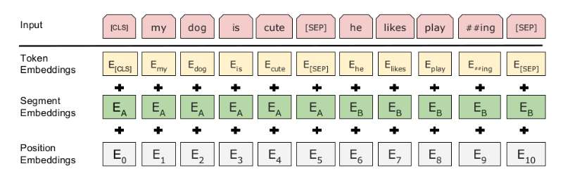
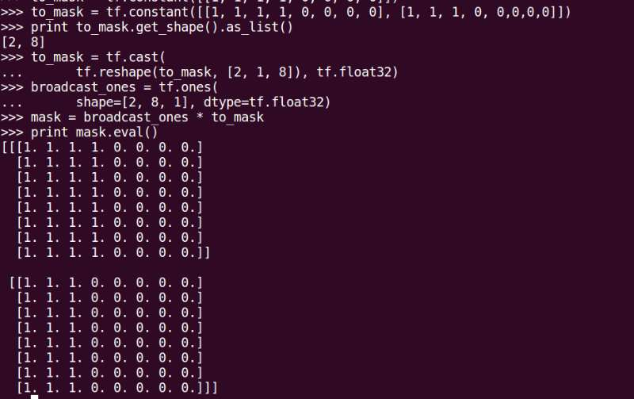

# BERT
BERT(Bidirectional Encoder Representations from Transformers)学习笔记
## What is BERT
BERT是一个可以用预训练来学习**语言表示(language representations)**的模型， 这意味着我们可以在大量文本语料上进行无监督的学习，来获取通用的**语义理解(language understanding)**, 然后我们可以将预训练得到的模型用于下游任务，比如QA，NLI等任务。


BERT预训练时，可以学习到双向的上下文知识，举个例子，我们会将句子中15%的词**遮盖(mask)**， 然后将结果输入给一个**deep bidirectional Transformer encoder**， 然后去预测遮盖住的词，比如：

```
Input: the man went to the [MASK1] . he bought a [MASK2] of milk.
Labels: [MASK1] = store; [MASK2] = gallon
```

然后为了学习句子之间的关系，也可以设计一个简单的训练模型，给定两个句子A和B， 去学习B是否为A的下一句。

```
Sentence A: the man went to the store .
Sentence B: he bought a gallon of milk .
Label: IsNextSentence
```
```
Sentence A: the man went to the store .
Sentence B: penguins are flightless .
Label: NotNextSentence
```

所以BERT模型包含两个部分： *Pretraining* and *fine-tuning*.

## BERT模型

Pretraining和fine-tuning都会用到BERT主模型网络，因此首先介绍BERT主网络结构。

首选是输入转换为向量表示：
```
input embeddings =  token_embeddings + segmentation_embeddings + postion_embeddings
```
   如图所示:

然后create_attention_mask_from_input_mask：


embedding后的输入会先输入给transformer的encoder网络，此处BERT做了一个通用的网络架构，不再区分encoder和decoder，可能是觉得decoder只有在类似翻译的任务中才用得到。

单个句子的任务时，不用做其他的处理，直接喂入encoder网络即可。但是在多个句子时，需要在每一个句子中间加一个**[SEP]**标识，在最开头处，加一个**[CLS]**标识，然后为了区分每一个句子，会有一个额外的输入，即标识当前词是哪一个句子，即代码中的segment_ids。

attention的接口为：
```
def attention_layer(from_tensor,
                    to_tensor,
                    attention_mask=None,
                    num_attention_heads=1,
                    size_per_head=512,
                    query_act=None,
                    key_act=None,
                    value_act=None,
                    attention_probs_dropout_prob=0.0,
                    initializer_range=0.02,
                    do_return_2d_tensor=False,
                    batch_size=None,
                    from_seq_length=None,
                    to_seq_length=None):
```

其中因为只用到了transformer中的encoder，因此from_tensor和to_tensor是一样的，都是输入embedding后的结果，shape为[batch_size, seq_length, embedding_size]


```
  This function first projects `from_tensor` into a "query" tensor and 
  `to_tensor` into "key" and "value" tensors. These are (effectively) a list
  of tensors of length `num_attention_heads`, where each tensor is of shape
  [batch_size, seq_length, size_per_head].
```

因为是encoder，所以输入的""


## Pretraining

word2vec和bert预训练的本质差不多，都是根据上下文去预测某个词，本小节我们通过看源码来了解一下，预训练是怎么完成的。

首先看一下输入如何进行转换:
```
origin_sentence:
A: 1699的米家扫地机器人，不能拖地
B: 不能本人收货
```

以上两个句子先分词（google发布的预训练模型用WordPiece分的词，用在中文里基本类似分字了），得到两个句子的tokens：
```
tokens: [CLS] 169 ##9 的 米 家 扫 地 机 器 人 ， 不 能 拖 地 [SEP] 不 能 本 人 收 货 [SEP]
```
分完词之后，会在最前面加一个[CLS]标识， 句子中间和最后分别加一个[SEP]标识。

然后得到：
```
input_ids: 101 9853 8160 4638 5101 2157 2812 1765 3322 1690 782 8024 679 5543 2870 1765 102 679 5543 3315 782 3119 6573 102 0 0 0 0 0 0 0 0 0 0 0 0 0 0 0 0 0 0 0 0 0 0 0 0 0 0 0 0 0 0 0 0 0 0 0 0 0 0 0 0
input_mask: 1 1 1 1 1 1 1 1 1 1 1 1 1 1 1 1 1 1 1 1 1 1 1 1 0 0 0 0 0 0 0 0 0 0 0 0 0 0 0 0 0 0 0 0 0 0 0 0 0 0 0 0 0 0 0 0 0 0 0 0 0 0 0 0
segment_ids: 0 0 0 0 0 0 0 0 0 0 0 0 0 0 0 0 0 1 1 1 1 1 1 1 0 0 0 0 0 0 0 0 0 0 0 0 0 0 0 0 0 0 0 0 0 0 0 0 0 0 0 0 0 0 0 0 0 0 0 0 0 0 0 0
```
*input_ids*表示对应的词表index， 少于*MAX_LEN*的补0；
*input_mask*中1表示有真的词，0表示*padding*;
*segment_ids*中0表示第一个句子，1表示第二个句子;

