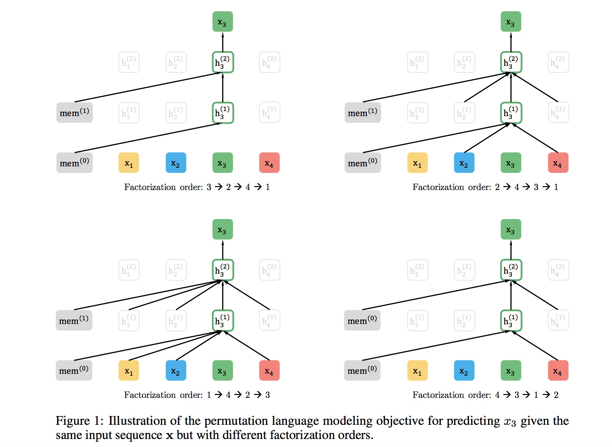

## 后BERT时代的预训练模型对比分析

BERT系列模型的改进点：

* 引入常识： ERNIE1.0 / ERNIE(THU) / ERNIE2.0
* 引入多任务学习： MTDNN / ERNIE2.0
* 精细调参： RoBERTa

### 自回归模型和自编码模型

1） 自回归语言模型

自回归语言模型就是从左到右预测下一个词

* 优点：属于文本序列联合概率的密度估计，即为传统的语言模型，天然适合处理**自然生成任务**;

* 缺点：只能单向的预测，无法通过上下文信息进行双向特征表征；

2） 自编码语言模型

* 优点：自编码语言模型是通过引入噪声[MASK]构建MLM模型，获取上下文相关的双向特征表示；
* 缺点：引入了独立性假设，为联合概率的有偏估计，没有考虑预测[MASK]之间的相关性。 不适合直接处理生成任务，MLM预训练目标的设置造成预训练过程和生成过程不一致；预训练时的[MASK]噪声在finetune阶段不会出现，造成两阶段不匹配问题；

### BERT存在哪些优缺点

* 优点： 能够获取上下文相关的双向特征表示；
* 缺点： 

	* 生成任务表现不佳：预训练过程和生成过程不一致
	* 输入噪声[MASK]，造成预训练-精调两阶段之间的差异；
	* 无法处理文档级别的NLP任务，只适合处理句子和段落级别的任务；

### 针对BERT原生模型，后续的BERT系列模型是如何引入【知识】的？

1. ERNIE1.0（百度）

 * 在预训练阶段引入知识（实际是预先识别出的实体），引入3种[MASK]策略预测：
    * Basic-Level Masking: 对subword进行mask；
    * Phrase-Level Masking: mask连续短语； 
    * Entity-Level Masking: mask实体
2. ERNIE（THU）

 *  基于BERT预训练原生模型，将文本中的实体对齐到外部的知识图谱，并通过知识嵌入得到实体向量作为ERNIE的输入；

### XLNET的内核机制探究

XLNET兼顾了自回归语言模型（AR）和自编码语言模型（AE）的优点。

XLNET的创新点：
1. 仍使用自回归语言模型，为了解决双向上下文问题，引入了排列语言模型；
2. 排列语言模型在预测时需要target的位置信息，为此引入two-stream：content流编码到当前时刻的所有内容，而Query流只能参考之前的历史信息以及当前要预测的位置信息；
3. 为了解决计算量过大的问题，采取：随机采样语言排列 + 只预测一个句子后面的1/K的词；
4. 融合Transformer-XL的优点，处理过长文本。

1） 排列语言模型（Permutation LM， PLM）

XLNET想要融合自回归模型和自编码模型的优点，但是自回归模型因为是从左到右的语言模型，如果我们当前根据上文，要预测某个单词Ti，那么看上去它没法看到下文的内容。具体怎么做才能让这个模型：看上去仍然是从左到右的输入和预测模式，但是其实内部已经引入了当前单词的下文信息呢？

通过在预训练阶段，引入Permutation Language Model的训练目标。。什么意思呢？就是说，比如包含单词Ti的当前输入的句子X，由顺序的几个单词构成，比如x1,x2,x3,x4四个单词顺序构成。我们假设，其中，要预测的单词Ti是x3，位置在Position 3，要想让它能够在上文Context_before中，也就是Position 1或者Position 2的位置看到Position 4的单词x4。可以这么做：假设我们固定住x3所在位置，就是它仍然在Position 3，之后随机排列组合句子中的4个单词，在随机排列组合后的各种可能里，再选择一部分作为模型预训练的输入X。比如随机排列组合后，抽取出x4,x2，x3,x1这一个排列组合作为模型的输入X。于是，x3就能同时看到上文x2，以及下文x4的内容了。这就是XLNet的基本思想，所以说，看了这个就可以理解上面讲的它的初衷了吧：看上去仍然是个自回归的从左到右的语言模型，但是其实通过对句子中单词排列组合，把一部分Ti下文的单词排到Ti的上文位置中，于是，就看到了上文和下文，但是形式上看上去仍然是从左到右在预测后一个单词。

