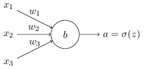

#### 交叉熵损失函数和MSE损失函数区别以及优缺点

理想情况下，我们希望神经网络模型可以从一些错误中快速学习，并改正错误。

MSE损失函数的缺点是，相对于交叉熵损失函数而言，学习的比较慢。

##### MSE损失函数学习慢的原因
而学习慢的原因在于，学习的过程中，要不断的更新w和b，而w和b的更新程度，取决于w和b对于损失函数的偏导数(partial derivatives),即$\partial C/\partial w$和$\partial C/\partial b$ 。所以学习的慢，在一定程度上，就是说偏导数比较小。

MSE的损失函数为:
$$C=\frac{(y-a)^2}{2}$$

其中，a即为神经网络的输出, $a=\sigma(z)$， 而$z=wx+b$

通过求导，得到(假设输入为1，x=1,输出为0，y=0)：
$$\frac{\partial C}{\partial w} = (a-y)\sigma^\prime(z) = a\sigma^\prime(z)$$
$$\frac{\partial C}{\partial b} = (a-y)\sigma^\prime(z) = a\sigma^\prime(z)$$

由于偏导数中存在sigmoid函数的导数，而sigmoid的导数在两边时，会趋近于0，所以$\partial C/\partial w$和$\partial C/\partial b$ 也会比较小，导致学习的速度很慢。

##### 交叉熵损失函数

假设神经网络为下图：

交叉熵损失函数的公式为：
$$C = -\frac{1}{n}\sum_{x}[y\ln a + (1-y)\ln (1-a)]$$

其中，n是训练的样本个数，$a=\sigma(z)$, $z=\sum_jw_jx_j+b$

交叉熵损失函数之所以可以用来作为损失函数，是因为它符合损失函数的两个必需特性。

1.非负性，即 $C > 0$, 求和项都为负值，然后前面有一个负号。

2.当预测值和真实值接近时，交叉熵损失会趋近于0

接下来看为什么交叉熵损失函数不会导致学习速度变慢（相对于MSE来说）。

首先，sigmoid函数的定义为$\sigma(z)=1/(1+e^{-z}))$，sigmoid函数的一个特性是$\sigma^\prime(z) = \sigma(z)(1-\sigma(z))$

通过求导，得到：

$$\frac{\partial C}{\partial w_j} = -\frac{1}{n}\sum_x(\frac{y}{\sigma(z)}-\frac{1-y}{1-\sigma(z)})\frac{\partial \sigma}{\partial w_j}$$
$$=-\frac{1}{n}\sum_x(\frac{y}{\sigma(z)}-\frac{1-y}{1-\sigma(z)})\frac{\partial \sigma}{\partial z}\frac{\partial z}{\partial w_j}$$
$$=-\frac{1}{n}\sum_x(\frac{y}{\sigma(z)}-\frac{1-y}{1-\sigma(z)})\sigma^\prime(z) xj$$
$$=\frac{1}{n}\sum_x\frac{\sigma^\prime(z)x_j}{\sigma(z)(1-\sigma(z))}(\sigma(z)-y)$$
$$=\frac{1}{n}\sum_xx_j(\sigma(z)-y)$$

也就是说，参数更新的速率和$（\sigma(z)-y）$成正比，也就是预测值和真实值的误差值，误差越大，学习的越快，同时交叉熵损失的偏导数里，没有$\sigma^\prime(z)$这一项，因此相对来说，不用担心偏导数值太小。

同时，b的偏导数为：

$$\frac{\partial C}{\partial b} = \frac{1}{n}\sum_x(\sigma(z)-y)$$

