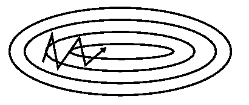

# 梯度下降算法概览
介绍一下各种梯度下降算法
## 梯度下降算法
* Batch gradient descent（批量梯度下降）
* Stochastic gradient descent(随机梯度下降)

### Batch gradient desent

批量梯度下降，顾名思义，就是直接用整个训练集计算损失函数的梯度，来更新参数:
$$\theta = \theta - \eta . \nabla_\theta J(\theta)$$

**优点**
* 损失函数为凸函数时，可以保证收敛到全局最优值；如果是非凸函数，则只能收敛到局部最优。

**缺点**
* 但是直接计算整个训练集的梯度的话，一是计算的很慢，二是很 耗费内存。
* 不能够在线更新

### Stochastic gradient descent

stochastic gradient descent测试每次只计算一个训练样本$x^{(i)}$和$y^{(i)}$:
$$\theta = \theta - \eta . \nabla_\theta J(\theta; x^{(i)}; y^{(i)})$$

**优点**
* 和Batch gradient desent相比较，stoschastic gradient descent没有冗余的计算
* 可以在线更新

**缺点**
* SGD一会会造成损失的大幅震荡

### Mini-batch gradient descent
Mini-batch gradient descent则是以上两个方案的折中方案，即每次更新一个小batch的训练样本：
$$\theta = \theta - \eta . \nabla_{\theta}J(\theta; x^{(i:i+n)}; y^{(i;i+n)})$$

**优点**

* 减小了参数更新的方差，可以更稳定的收敛
* 可以利用并行算法加速训练

## 依然存在的挑战

但是Mini-batch gradient descent还是有一些问题，不能保证一定很好的收敛，因此还有一些可以优化的地方：

* 怎么选择一个好的学习率：学习率小的话，会导致收敛很慢，而太大的学习率则会导致不好收敛，且损失会震荡的比较厉害。
* 怎么在训练的过程中，动态的调整学习率
* 对于不同的数据，选择不同的学习率：不同的训练样本出现的频率不一样，一般情况下，我们希望对于比较稀有的数据，给较大的学习率。
* 怎么避免得到局部最优结果

## Gradient descent optimization algorithms
下面列出一些被广泛应用的梯度下降优化算法。

## Momentum(动量)
SGD有一个缺点，很难通过陡谷，即在一个维度的表面弯曲程度远大于其他维度的区域，这种情况通常出现在局部最优点附近。如下图所示，纵向的梯度比横向的要大的多，这样的话，“行进路线”会在纵向上大幅震荡，且会比较慢才会达到最优点。

Momentum算法借鉴了物理中的动量概念，在计算当前梯度方向时，在一定程度上保留之前更新的方向，同时也加上当前batch的梯度微调最终的更新方向。这样在纵向上震荡会小很多，可以学习的更快，还有一定摆脱局部最优的能力。
如图所示，在行进的过程中，在纵向上的梯度会稍有缓和，且会更快的到达最优点。

加上动量的参数更新公式为：
$$\nu_{t} = \gamma\nu_{t-1} + \eta \nabla_{\theta}J(\theta)$$
$$\theta = \theta - \nu_{t}$$

从本质上说，动量法，就像我们从山上推下一个球，球在滚下来的过程中累积动量，变得越来越快（直到达到终极速度，如果有空气阻力的存在，则γ<1）。同样的事情也发生在参数的更新过程中：对于在梯度点处具有相同的方向的维度，其动量项增大，对于在梯度点处改变方向的维度，其动量项减小。因此，我们可以得到更快的收敛速度，同时可以减少摇摆。

## Adam优化器

Adam优化器是一个新手可以比较放心使用的优化器，只需要设置初始学习率，一般就可以得到比较满意的训练结果，初始学习率默认是0.001，另外训练的batch_size，也会在一定程度上影响学习率，一般来说，较大的batch_size, 对应较小的学习率。有时候训练时，出现loss比较震荡的情况时，会建议增大batch_size, 一般就是因为这个原因，其实就是变相的减小了学习率。

Adam名字的来源是***adaptive moment estimation***, 即***动态动量***。 Adam优化器是借鉴了AdaGrad和RMSProp，集合了2个算法的优点，并做了一些自己的改进。

Adam也是一个随机梯度下降的优化方法，其本质是对于一个损失函数，损失函数的变量如果可微的话，那么就可以通过梯度下降的方法来求损失函数的最大值或最小值。