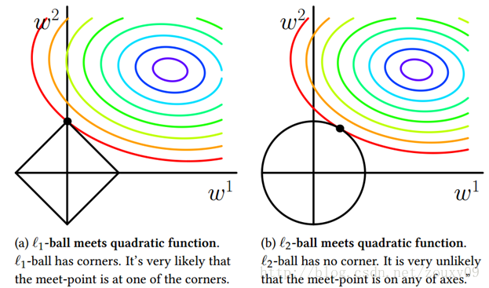
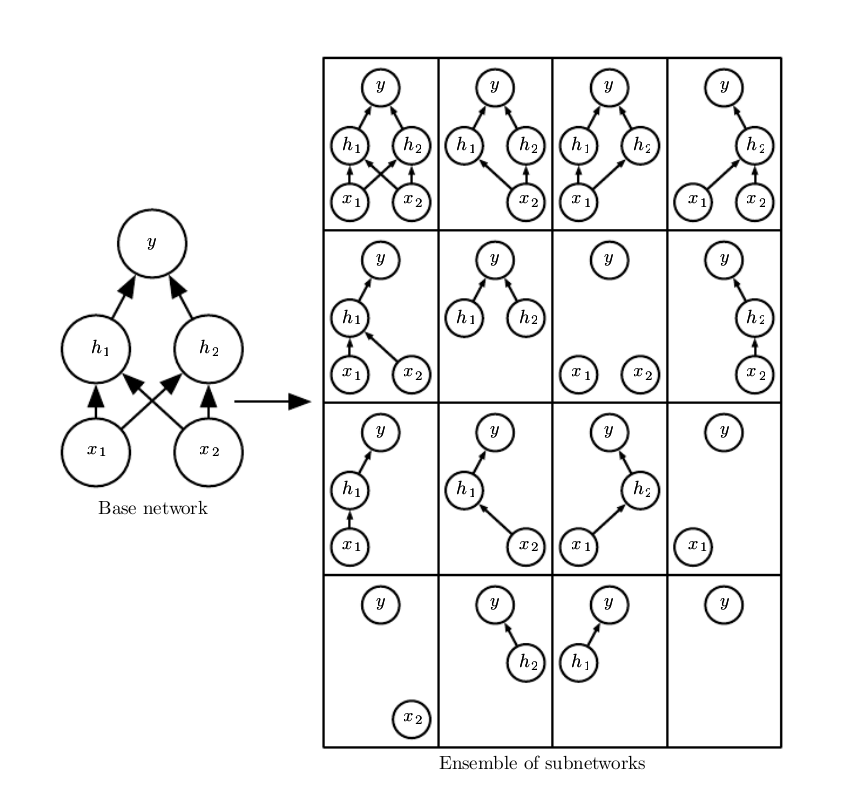
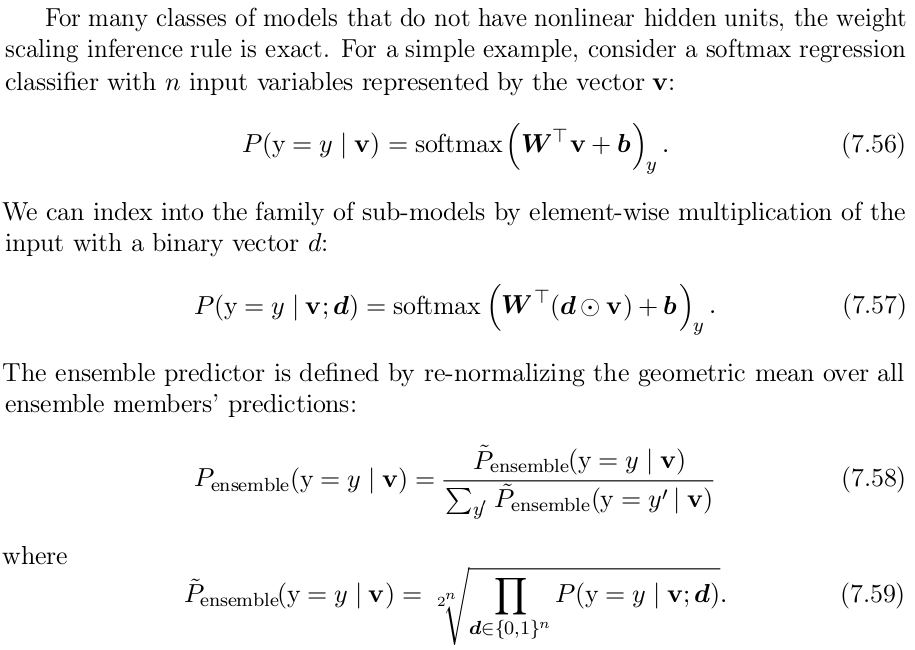
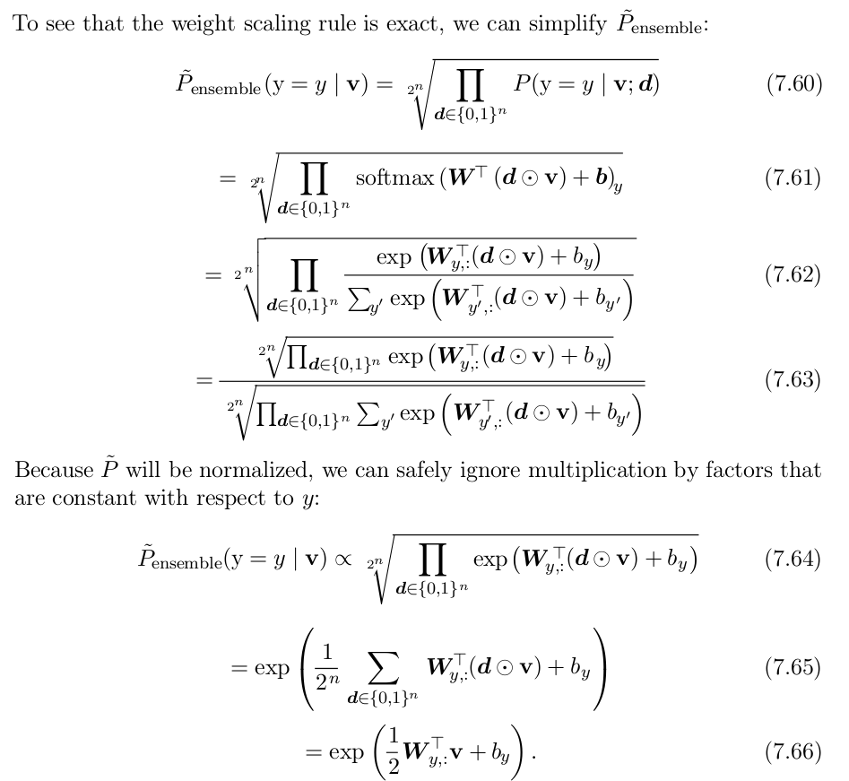

### 过拟合以及正则化

1.L2正则化
	
   L2正则化就是给损失函数加一个对参数的限制值，也叫正则项。正则化的交叉熵损失函数为：
   $$C=-\frac{1}{n}\sum_{xj}[y_j\ln a_j^L+(1-y_j)\ln (1-a_j^L)]+\frac{\lambda}{2n}\sum_ww^2$$
   
   一个通用的写法是：
   $$C = C_0 + \frac{\lambda}{2n}\sum_ww^2$$
   其中，$C_0$为原始的损失函数项， $\lambda$为正则系数，正则项一般不加偏置，因为当输入变化时，偏置不太会影响最终的变化。
   
   正则化的主要目的是学习较小的权重，同时获得较小的损失，而正则系数的作用，就是在两者之间做一个权衡。
   
   通过一个例子，来证明为什么正则化可以防止过拟合：
   求偏导数得到：
   $$\frac{\partial C}{\partial w} = \frac{\partial C_0}{\partial w}+\frac{\lambda}{n}w$$
   $$\frac{\partial C}{\partial b} = \frac{\partial C_0}{\partial b}$$
   那么参数更新时：
   $$b\rightarrow b-\eta\frac{\partial C_0}{\partial b}$$
   $$w\rightarrow w-\eta\frac{\partial C_0}{\partial w}-\frac{\eta\lambda}{n}w$$
$$=(1-\frac{\eta\lambda}{n})w-\eta\frac{\partial C_0}{\partial w}$$
这样一来，每次权重更新时，w都会先乘一个系数：$(1-\frac{\eta\lambda}{n})$, 这个系数一定是小于1的，那么每次 更新时，w都会以一定的比率缩小，也就是实现了所谓的***权重衰减(weight decay)***，然而一直衰减也不会导致w变成0，因为后面的$\eta\frac{\partial C_0}{\partial w}$有可能让w变大。

#### 正则化可以防止过拟合的原因

1.正则化可以让模型更简单

2.正则化之后，小的输入变化，不会导致太大的输出变化

#### L1正则化容易产生稀疏特征的原因

如左图所示，考虑只有两个参数的情况，在（$w_1, w_2$）平面上，可以画出目标函数的等高线，而对参数的约束，见图中的黑线，L1的约束形成了一个“菱形”

#### Dropout

Dropout是一种廉价的Bagging集成近似，具体来说，dropout训练的模型，包括整个网络的所有可能的子网络，如图所示：



dropout的目标是在指数级数量的这么多个神经网络模型上近似bagging，但是直接训练这么多个模型需要花费太太太太太太多运行时间和内存。

所以dropout的作者提出了一种近似训练这么多个模型的方法，就是在训练的过程中，每次都以一定的概率随机丢弃一些输入单元或隐藏单元，从而形成不同的模型结构，这样每次训练的都是不同的模型。

那么问题来了，训练的时候，训练了N多个模型，在预测的时候用哪个呢？

答案是，用整个网络，，所有输入单元和隐藏单元则都不会被丢弃，但是每个单元的权重都会乘以在训练过程中被包含的概率值，从而近似得到bagging的效果，这种方法叫做*权重比例推断（weight scaling inference rule）*。

从数学的角度看，dropout的做法是，近似计算得到所有模型的*几何平均*。

*两个数a和b的算术平均值为$(a+b)/2$，几何平均值为$\sqrt{ab}$


在做inference的时候，理论上bagging需要计算所有模型的算术平均结果：

$$\frac{1}{k}\sum_{i=1}^{K}p^{(i)}(y|x)$$

在dropout的情况下，通过掩码$u$定义每个子模型的概率分布$p(y|u,x)$。所有掩码的算术平均值为：

$$\sum_{u}p(u)p(y|x,u)$$

对应的几何平均值为：

$$p^{-}_{ensemble}(y|x) = \sqrt[2^d]{\prod_{u}p(y|x,u)}$$


权重比例推断的证明：






# tensorflow的实现
```
tf.nn.dropout(
    x,
    keep_prob,
    noise_shape=None,
    seed=None,
    name=None
)
```
With probability keep_prob, outputs the input element scaled up by 1 / keep_prob, otherwise outputs 0. The scaling is so that the expected sum is unchanged.

tensorflow的做法是，在训练的时候，将权重增大，即除以（1/keep_prob），而在inference的时候，权重保持不变。

从另外一个角度看，dropout减小了模型的有效容量，为了抵消这种影响，需要增大模型规模。
