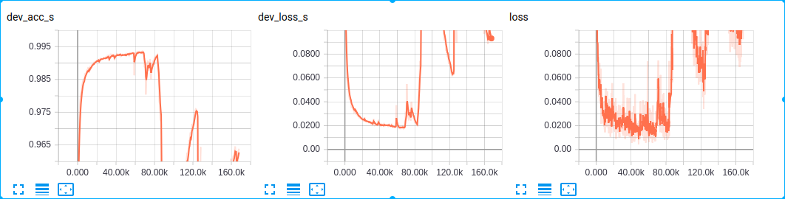

# batch_size对训练loss震荡的影响

当数据量比较大时，使用小的batch_size, 比如数据量在500万以上，batch_size为128时，训练一个epoch之后，训练loss就会发生剧烈震荡

如图所示，这个已经是batch_size为512时的loss曲线，在训练很久之后才开始大幅震荡；当batch_size为128时，训练一个epoch之后，就开始出现大幅震荡的现象，最终在测试集上的效果也不好。

batch_size越大，也意味着更小的learning rate，batch_size越小，也意味着更大的learning rate