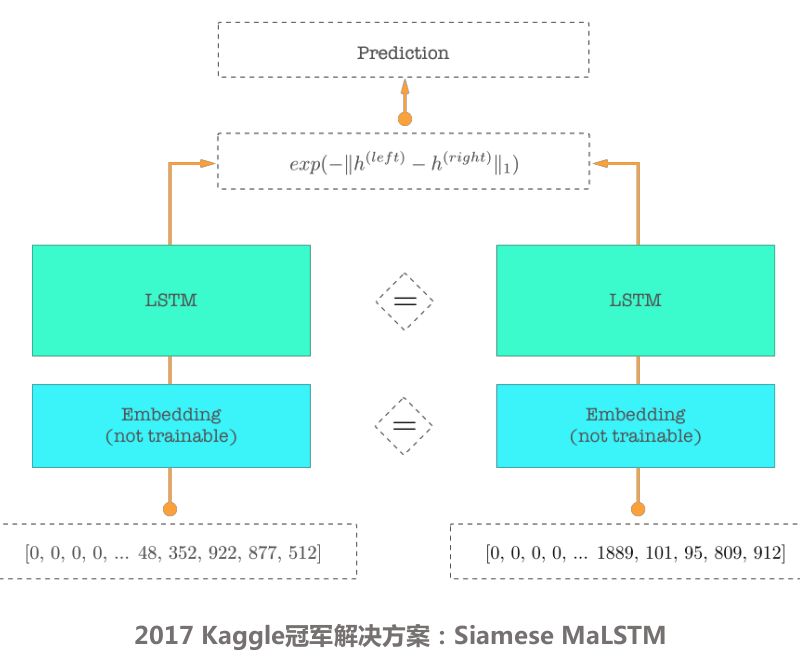

# 孪生网络

孪生网络主要用于同质化的两个item的相似度的计算，例如query和对应candidate的相似度计算，其主要场景在QQ（query-query）类的问答。孪生网络的优点在于：

1. query和candidate的encoder结果的计算是独立的，没有交互计算，也就是所谓是表示学习，所以在线上运行时，candidate的encoder结果可以提前做离线计算，线上直接根据id检索对应结果，大大减小了线上的运行耗时。
2. 孪生网络query和candidate的词嵌入部分和encoder部分都是一样的，从而保证相同的query和candidate的encoder结果一定的一样的，进而在做距离计算时，各种距离的计算结果对应的相似度一定是1，相比于正常的神经网络，最后一层一般是全连接层，全连接层接softmax的结果，无法保证相同的两个query的相似度一定为1.

# encoder之后的距离计算以及对应损失函数

* L2距离以及contrastIve loss， contrastIve loss的公式为：
$$L = \frac {1}{2N}\sum_{n-1}^{N} yd^2 + (1-y)max(margin-d, 0)^2$$
* cosine距离以及对应损失函数

pytorch中有一个CosineEmbeddingLoss， 公式为:
$$loss(x,y) = 
\begin{cases} 
1 - cos(x,y)& \text{y==1}\\
max(0, cos(x,y) + margin)& \text{y==-1}
\end{cases}$$

* 马氏距离以及对应损失函数
$$d = exp(-\vert\vert{x}-{y}\vert\vert_1)$$
$$L= \frac{1}{2N}\sum_{n=1}^{N}(y-d)^2$$

