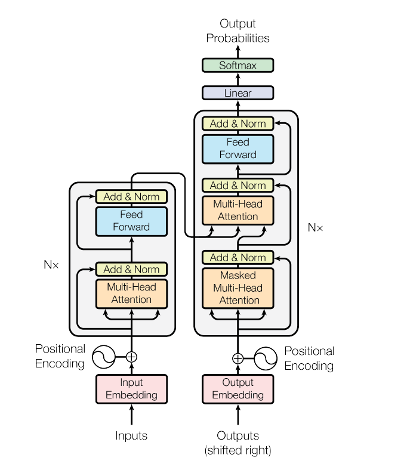
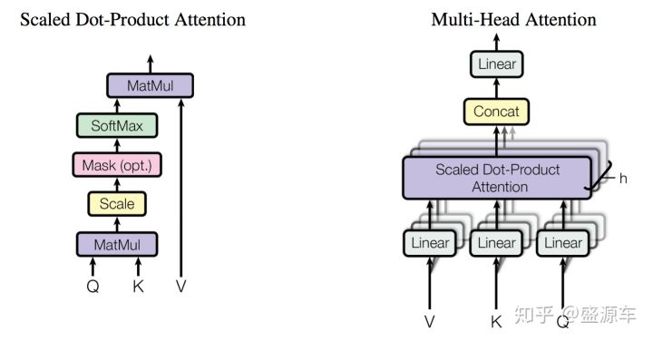

# Transformer学习
## transformer简介

transformer是在google的论文《Attention is all you need》中被提出了，transformer主要还是作为特征提取的子网络存在，其比rnn具备更长距离的特征提取能力，且计算速度也比rnn要快，还可以做并行处理。

transformer在《Attention is all you need》中，主要是用来做机器翻译，因此transformer也承担了两个角色：encoder和decoder，具体如下图所示：



如论文标题所言，transformer网络中“只”存在attention mechanisms.

## Encoder

此文假设transformer特指encoder部分，transformer本身网络也比较简单，有6层，每一层的网络都一样，上一层的输出作为下一层的输入。

每一层有两个子网络，第一个子网络是multi-head self-attention mechanism，第二个子网络则是一个简单的全连接层，叫feed forward。每一层都会应用一个residual connection，再接上一个layer normalization。每一层的输出都是$LayerNorm(x + SubLayer(x))$.

## Attention
attention一般是对于一个query，对&lt;keys，values&gt;对做一个映射，得到一个输出，其中，输出是一个带权重的values之和。而权重则有query和keys计算得出。

### Scaled Dot-Product Attention

如上图左图所示，基础的Attention版本，就是querys和keys做dot-product操作，然后做一个scale，接一个softmax，得到对应的权重，权重乘以values得到输出，公式如下：
$$Attention(Q,K,V) = softmax(\frac{QK^T}{\sqrt{d_k}})V$$

其中，scale表现在除以$\sqrt{d_k}$，当$d_k$较小时，做不做scale差别不大，但是当$d_k$较大时，dot-prodcut的结果也会跟着变大，会导致softmax的梯度很小，因此做一个scale操作以避免此现象。

### Multi-Head Attention

实际上不会简单的使用Scaled Dot-Prodcut Attention, 会先对queries，keys，vlaues做一个线性映射，实际代码在映射的时候，会直接把multi-head也带上，如下代码所示:
```
 # Scalar dimensions referenced here:
  #   B = batch size (number of sequences)
  #   F = `from_tensor` sequence length
  #   T = `to_tensor` sequence length
  #   N = `num_attention_heads`
  #   H = `size_per_head`

  from_tensor_2d = reshape_to_matrix(from_tensor)
  to_tensor_2d = reshape_to_matrix(to_tensor)

  # `query_layer` = [B*F, N*H]
  query_layer = tf.layers.dense(
      from_tensor_2d,
      num_attention_heads * size_per_head,
      activation=query_act,
      name="query",
      kernel_initializer=create_initializer(initializer_range))
```
之前对multi-head attention有一些误解，也写下来记录一下。之前以为multi-head是指把向量分割成多个小向量，然后分别做attention，- -

此次细看论文才发现不是，multi-head只是做了h次scaled dot-product attention，也如上面代码所示，只是在映射的时候，会映射出h个不同的“queries、keys、values”，其中
$$attention\_head\_size = int(hidden\_size / num\_attention\_heads)$$

这样的话，分别做完attention之后，拼接起来的向量的size，刚好也是hidden_size.

具体公式如下：
$$MultiHead(Q,K,V) = Concat(head_1, head_2, ... , head_h)W^O$$

$$where head_i = Attention(QW^Q_i, KW^K_i, VW^V_i)$$


## transformer应用
后来很多论文都开始把transformer应用到很多其他的nlp相关领域，例如GPT（Generative Pre-Training）, BERT等等，只不过他们都只用encoder部分，不需要decoder部分，因此文本主要介绍transformer的encoder部分。

之前深度学习的nlp模型基本上是lstm的天下，用lstm来做特征提取基本是最好的选择，现在transformer是最好的encoder利器无疑了，比cnn，rnn都要好。

由于transformer相对于cnn和rnn而言，参数要多的多，所以如果要用transformer对文本做encode的话，学习率要相对设置的小一点，效果才会好。


